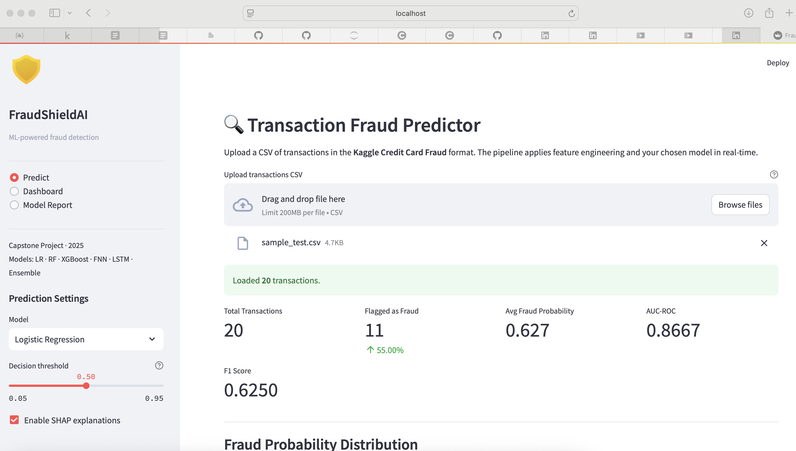
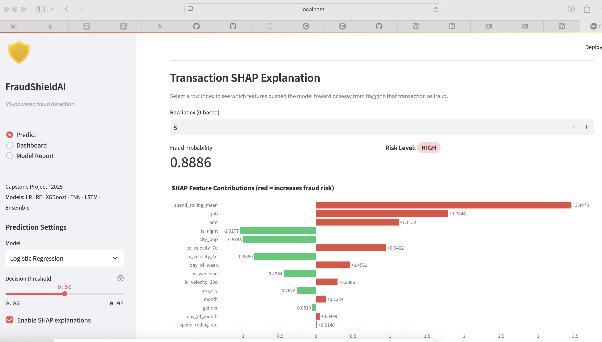
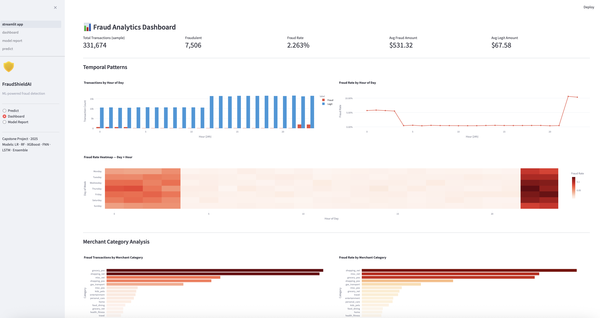
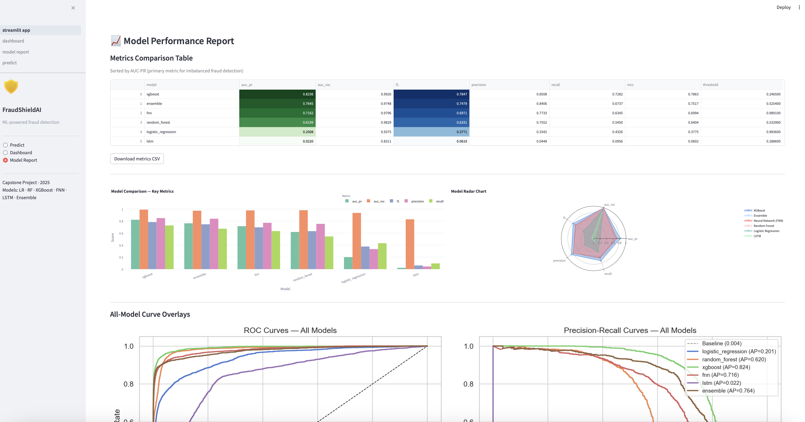

# FraudShieldAI

A production-grade, end-to-end fraud detection system combining supervised learning, deep learning, and a hybrid ensemble — built as a capstone ML portfolio project.


---

## Overview

FraudShieldAI detects fraudulent credit card transactions using a multi-model approach:

| Model Family | Algorithms |
|---|---|
| Supervised Learning | Logistic Regression, Random Forest, XGBoost (Optuna tuned) |
| Deep Learning | Feedforward Neural Network (FNN), LSTM |
| Ensemble | Soft-voting / Stacking hybrid |

The system addresses the core challenges of real-world fraud detection:
- **Severe class imbalance** (~0.58% fraud rate) handled via SMOTE + `class_weight='balanced'`
- **High-volume data** (1.85M total transactions across train + test)
- **Interpretable predictions** via SHAP explanations for every model
- **Configurable pipeline** driven by YAML — no hardcoded hyperparameters

---

## Architecture

```
FraudShieldAI/
├── data/
│   ├── raw/                      # Original Kaggle CSVs (gitignored)
│   └── processed/                # Engineered features, Parquet format
├── notebooks/
│   └── 01_eda.ipynb              # Full EDA — 11 sections, all visualisations
├── src/
│   ├── data/
│   │   ├── preprocessing.py      # Cleaning, encoding (target/label), scaling, SMOTE
│   │   └── features.py           # Geo distance, velocity, spend, time features
│   ├── models/
│   │   ├── trainer.py            # Orchestrates full training run
│   │   ├── supervised.py         # LR, Random Forest, XGBoost + Optuna tuning
│   │   ├── fnn.py                # PyTorch FNN with early stopping
│   │   ├── lstm.py               # PyTorch LSTM with sequence builder
│   │   └── ensemble.py           # Soft-voting and stacking ensemble
│   ├── evaluation/
│   │   ├── evaluator.py          # Plots, SHAP, model comparison table
│   │   └── metrics.py            # AUC-PR, AUC-ROC, F1, MCC, optimal threshold
│   └── utils/
│       ├── config.py             # YAML config loader
│       └── helpers.py            # Timer, save/load artifact, memory reduction
├── app/
│   ├── streamlit_app.py          # Main app entry point (3-page navigation)
│   ├── utils.py                  # Cached model loading, inference, SHAP per-row
│   └── pages/
│       ├── predict.py            # CSV upload → real-time predictions + SHAP waterfall
│       ├── dashboard.py          # Fraud trend analytics (Plotly)
│       └── model_report.py       # Metrics table, ROC/PR curves, SHAP plots
├── configs/
│   ├── pipeline.yaml             # Data paths, SMOTE settings, scaling
│   └── models.yaml               # Hyperparameters + Optuna search spaces
├── tests/
│   ├── conftest.py               # Shared fixtures (synthetic Kaggle-schema DataFrame)
│   ├── test_features.py          # 25 tests — geo, time, age, velocity, spend
│   ├── test_metrics.py           # 14 tests — AUC, threshold, confusion matrix
│   └── test_preprocessing.py     # 16 tests — drop, encode, scale, SMOTE
├── .github/workflows/ci.yml      # GitHub Actions — lint + pytest on Python 3.10 & 3.11
├── main.py                       # CLI pipeline entrypoint
├── requirements.txt
├── setup.py / setup.cfg          # Editable install (pip install -e .)
└── pytest.ini
```

---

## Screenshots

### Predict — Real-time fraud scoring with risk badges


### Predict — Per-transaction SHAP explanation


### Dashboard — Fraud trend analytics


### Model Report — Metrics comparison + SHAP feature importance


---

## Dataset

**Source:** [Credit Card Transactions Fraud Detection Dataset — Kaggle](https://www.kaggle.com/datasets/kartik2112/fraud-detection)

| Split | Rows | Fraud Rate |
|---|---|---|
| Train | 1,296,675 | 0.58% |
| Test | 555,719 | 0.39% |

**Features:** transaction datetime, credit card number, merchant, category, amount, cardholder location (lat/long), merchant location, city population, cardholder demographics (DOB, gender, job).

**Target:** `is_fraud` — binary (1 = fraudulent, 0 = legitimate).

### Download

```bash
# Requires Kaggle API credentials (~/.kaggle/kaggle.json)
kaggle datasets download -d kartik2112/fraud-detection -p data/raw --unzip
```

---

## Quick Start

### 1. Clone and install

```bash
git clone https://github.com/maheshgadi-ai/FraudShieldAI.git
cd FraudShieldAI

python -m venv venv
source venv/bin/activate          # Windows: venv\Scripts\activate

# CPU PyTorch (lighter — no CUDA required)
pip install torch==2.3.0 --index-url https://download.pytorch.org/whl/cpu

pip install -r requirements.txt
pip install -e .
```

### 2. Download data

```bash
kaggle datasets download -d kartik2112/fraud-detection -p data/raw --unzip
```

### 3. Run the full pipeline

```bash
# All stages: preprocess → train → evaluate
python main.py --stage all

# Or stage by stage
python main.py --stage preprocess   # ~30s — feature engineering, SMOTE, save Parquet
python main.py --stage train        # longest — Optuna tuning + FNN + LSTM
python main.py --stage evaluate     # metrics, SHAP plots, comparison table
```

### 4. Launch the web app

```bash
streamlit run app/streamlit_app.py
```

### 5. Run tests

```bash
pytest tests/ -v --cov=src
```

---

## Feature Engineering

9 domain-driven features added on top of raw transaction data:

| Feature | Description |
|---|---|
| `geo_distance_km` | Haversine distance (km) between cardholder and merchant |
| `tx_velocity_1d` | Transaction count per card in past 24 hours |
| `tx_velocity_7d` | Transaction count per card in past 7 days |
| `tx_velocity_30d` | Transaction count per card in past 30 days |
| `spend_rolling_mean` | Rolling 30-day mean transaction amount per card |
| `spend_rolling_std` | Rolling 30-day std dev of amount per card |
| `spend_ratio` | Current amount ÷ rolling mean (flags unusually large charges) |
| `hour` / `day_of_week` / `is_weekend` / `is_night` | Temporal signals |
| `age` | Cardholder age derived from DOB + transaction timestamp |

High-cardinality categoricals (`merchant`, `category`, `job`) are **smoothed target-encoded** (fraud rate per category, with Laplace smoothing). `gender` is label-encoded.

---

## Model Performance

Results on the held-out test set (555,719 transactions, fraud rate 0.39%):

| Model | AUC-PR | AUC-ROC | F1 | Precision | Recall | MCC |
|---|---|---|---|---|---|---|
| **XGBoost** | **0.8236** | **0.9920** | **0.7847** | **0.8508** | 0.7282 | **0.7863** |
| Ensemble | 0.7645 | 0.9748 | 0.7479 | 0.8406 | 0.6737 | 0.7517 |
| FNN | 0.7162 | 0.9796 | 0.6971 | 0.7733 | 0.6345 | 0.6994 |
| Random Forest | 0.6199 | 0.9829 | 0.6331 | 0.7552 | 0.5450 | 0.6404 |
| Logistic Regression | 0.2008 | 0.9375 | 0.3771 | 0.3342 | 0.4326 | 0.3775 |
| LSTM | 0.0220 | 0.8311 | 0.0610 | 0.0448 | 0.0956 | 0.0602 |

> **Primary metric is AUC-PR** (Average Precision), not AUC-ROC — AUC-ROC is misleading on severely imbalanced datasets. All thresholds are chosen to maximise F1 on the PR curve.

> **LSTM note:** underperformed because SMOTE disrupts natural per-card temporal ordering — the sequences lose their time-series structure. A production system would use raw (un-oversampled) sequences sorted by card + timestamp.

Full per-model reports, ROC/PR curve overlays, confusion matrices, and SHAP plots are saved to `outputs/` after running the evaluate stage.

---

## Explainability (SHAP)

SHAP values are computed for every model to explain individual fraud predictions:

- **Tree models** (RF, XGBoost) — `TreeExplainer` (exact, fast)
- **Linear model** (LR) — `LinearExplainer`
- **Neural models** (FNN, LSTM) — `GradientExplainer`

Outputs: bar plot (global feature importance), beeswarm summary plot, raw `.npy` values — all saved to `outputs/shap/`.

The **Streamlit Predict page** shows a per-transaction SHAP waterfall chart — select any uploaded transaction row and see exactly which features drove the fraud score.

---

## Web Application

Three-page Streamlit app:

| Page | Features |
|---|---|
| **Predict** | Upload CSV → preprocessing → real-time fraud scores. Adjustable threshold slider, risk badges (LOW / MEDIUM / HIGH), colour-gradient results table, download CSV, SHAP waterfall for any row |
| **Dashboard** | Fraud analytics on raw data — volume by hour/day, fraud rate heatmap (day × hour), amount distributions, geographic scatter map, top merchants |
| **Model Report** | Metrics comparison table, bar chart + radar chart across models, ROC/PR overlays, per-model confusion matrix + training history, SHAP summary plots |

---

## Hyperparameter Tuning

All supervised models are tuned with **Optuna** (Bayesian optimisation):

| Model | Trials | Objective |
|---|---|---|
| Logistic Regression | 30 | AUC-PR (3-fold CV) |
| Random Forest | 30 | AUC-PR (3-fold CV) |
| XGBoost | 50 | AUC-PR (3-fold CV) |

Deep learning models use **early stopping** on validation AUC-PR with cosine annealing LR scheduler. All hyperparameter search spaces are defined in [configs/models.yaml](configs/models.yaml).

---

## Class Imbalance Strategy

| Technique | Where applied |
|---|---|
| SMOTE (sampling_strategy=0.1) | Training set only — test set untouched |
| `class_weight='balanced'` | Logistic Regression, Random Forest |
| `scale_pos_weight=10` | XGBoost |
| `BCEWithLogitsLoss(pos_weight=10)` | FNN and LSTM |
| AUC-PR as primary metric | All model selection and tuning |

---

## Technologies

| Category | Libraries |
|---|---|
| Data | Pandas, NumPy |
| ML | Scikit-learn, XGBoost, imbalanced-learn |
| Deep Learning | PyTorch |
| Tuning | Optuna |
| Explainability | SHAP |
| Visualisation | Matplotlib, Seaborn, Plotly |
| Web App | Streamlit |
| Testing | pytest, pytest-cov |
| CI | GitHub Actions |

---

## Project Structure Notes

- All hyperparameters live in `configs/` — the code never has magic numbers
- `pip install -e .` makes `from src.xxx import yyy` work from any directory
- Data and model outputs are gitignored — only code and configs are versioned
- 45+ unit tests cover feature engineering, metrics, and preprocessing in isolation

---

## License

MIT
